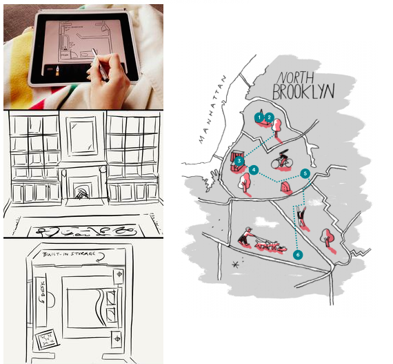

Trax is a mobile app to help airbnb superhosts orient their guests.  It lets hosts produce a basic field guide to their home and neighborhood.  The aim is to make it easy for hosts to share their key insights about the place they call home and the local experiences it affords.

Trax is the napkin on which a host can sketch out a personalized map of their domain for guests, their own idiosyncratic view of place.  

Trax attempts to elicit the mental map of a host and their essential local insights.  A host's knowledge of place is encoded while undertaking a "walkthrough" of the home and a "walkabout" the neighborhood, device in hand.

In the course of this recorded excursion through and around a host's domain,
the host is encouraged to take pictures of "points of interest".  Within these images, a host can leave targeted "memos" for guests with a force-touch or "tags" with a simple touch.  The resulting memos appear as blue dots at the touched portion of the image.  Similarly, tags appear as hashtags on the touched portion of the image.

This provides hosts with a simple mechanism for directing the attention of
guests, where the intent may be practical, utilitarian, and sundry (`#fragile` or "you'll find a picnic basket and bottle opener in this lower cabinet") or merely aesthetic (`#vista` or "note the blazing curl of the whitecaps below come sunset"). 

In short, trax records the routes undertaken by a host, scenes captured along these routes, and points of meaning within these scenes.  Trax uses this captured info to generate a personalized mobile field guide for the host's guests.

The micro field guides (called "trex") generated by trax contain visual depictions of a place rather than verbose textual descriptions; they're personalized sketch maps anchored in the host's home and immediate neighborhood. They offer basic orientation and access to a host-curated network of experiential routes.

Like any good sketch map, trex provides guests with a lay of the land from
their host's perspective.  Imagine a host, welcoming his guest, giving him a quick walkthrough upon arrival: "OK. You are here. This is the basic layout of my place.  These are the key spots in the neighborhood.  Here's what you can experience when you walk out the door." 

Unlike static sketch maps, trex is location- and motion-aware, utilizing the spatial sensors in a guest's mobile device.  It can tell them where they are in relation to their host's recommended experiential network.  It also knows and can take advantage of the orientation of the device on which they're viewing it.

This contextual awareness affords trex the ability to selectively disclose contextually relevant information ... and to suppress what is contextually irrelevant.  

The spatial depiction presented to a user is always keyed to the user's location and their inferred field of view.  A user is presented with a birdseye view of their current location.  The orientation of the "map" presented to the 
user mirrors the device's orientation, as if the device were a camera,
projected a few hundred feet above the user.  The user's "field of view" 
(sometimes referred to as the user's "viewshed" or "isovist") is also depicted,
so as to ground the user's immediate perceptions within this elevated
perspective.

Trex has four modes:

* overview (scroll-driven narratives)
  * home
  * neighborhood
* navigation (wayshowing along a route)
* directory
* search
